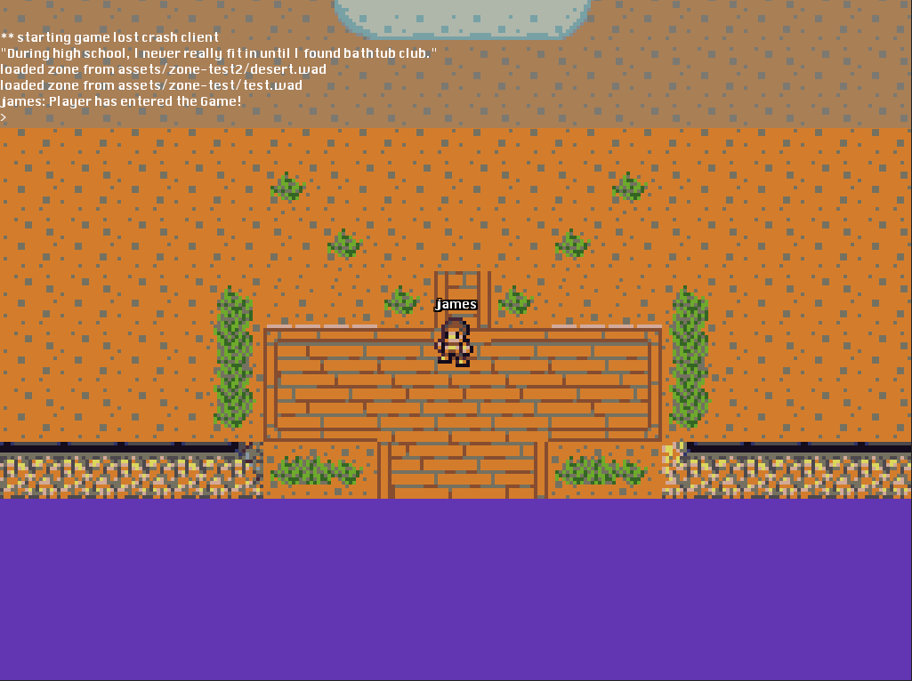

What is this?
=============

The canonical `Game Lost Crash` client that we use for hack day events. As such, the code here tends to be very experimental. `glc-client` will *probably* not eat your laundry (but we can't guarantee it).

The goal is to create a 2d online metaverse ("game lost crash" or `glc` for short) with user-defined rules and worlds: a distributed gaming platform, essentially.

This gaming platform can be used for e.g., shoot-em'-up games. Think of this metaverse as a collaborative and iterative attempt to help each other create 2d games (be they platformers, top-down RPGs, or what-have-you). In a sense, `glc-client` is also a communications platform, albeit one that encourages creativity and experimentation.

Components: Our languages consist of [Go](http://golang.org/) and [Lua](http://www.lua.org/). Our stack consists of [NSQ](https://github.com/bitly/nsq) and [MongoDB](http://www.mongodb.org/). We will eventually (ab)use IRC for messages. This is the frontend. For the backend, please see [glcd](https://github.com/gamelost/glcd).

Installation
============

You will need to download and install Love2D, which is a 2d platform graphical library for Lua. Get it at [http://love2d.org/](http://love2d.org/).

And of coure you will need to `git clone` this repository to a convenient location on your hard drive.

That's it!

__NB__: The code assumes a remote [NSQ](https://github.com/bitly/nsq) server which we have set up at `lethalcode.net` -- properly whitelisted, of course. (If you are experiencing NSQ connection issues, let us know your IP address.) For most purposes, you will not have to install anything else. Nonetheless, if you wish to run the entire network setup locally, the [docker](https://www.docker.com/) builds for this are still under progress -- stay tuned.

Starting up
===========

All methods use the command line.

__OSX__:

Open up a Terminal and type in:

	open -n -a love <directory of glc-client>

You can `cd` to the directory containing `glc-client` and type in:

	open -n -a love .

I recommend creating an alias in `~/.bash_profile` to execute the `love` binary directly. If you do not do this, output will not be visible on the console window.

Edit `~/.bash_profile` with `$YOUR_FAVORITE_EDITOR` and add the lines:

	alias love="/Applications/love.app/Contents/MacOS/love"

Run `source ~/.bash_profile` to make the new additions take effect. (This step only has to be done once: opening a new Terminal will automatically run the contents of this file).

Once the `love` alias is set up, simply typing the following in the `glc-client` directory will work:

	love .

__Linux__:

	love <directory of glc-client>

Example usage:

	james@lattice:~/hackday/glc-client$ love .
	logged:	** starting game lost crash client

__Windows__:

There is no official support as of yet, although there is no particular reason why running under Windows should not work. If you want to champion Windows platform support, drop us a line!

Screenshots
===========

Trouble-shooting
================

There are more detailed instructions about running `love` directly [here](http://love2d.org/wiki/Getting_Started).

The code may indeed be broken. Look at the list of [github issues](https://github.com/gamelost/glc-client/issues) to see if the bug has already been reported. Otherwise add a new issue!

Of course, you can ask us any question at (almost) any time on IRC at `#gamelost` on freenode.net.

License
=======

Apache 2.0. See the [LICENSE](LICENSE) for more details.